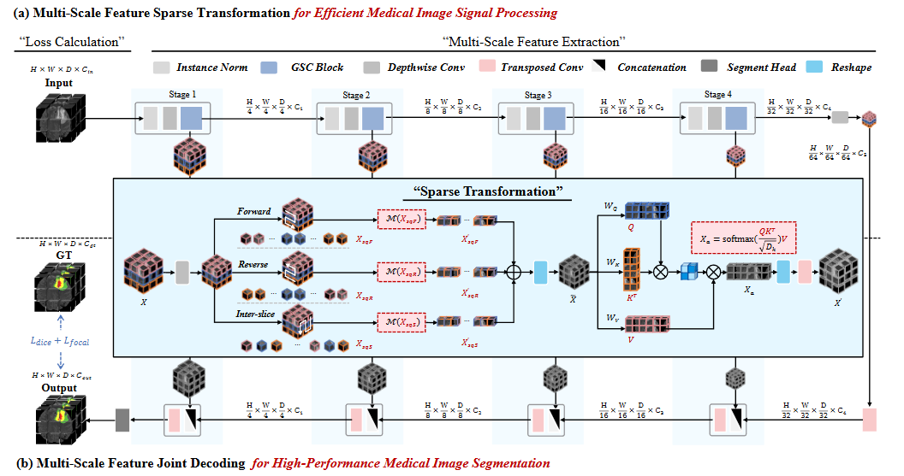
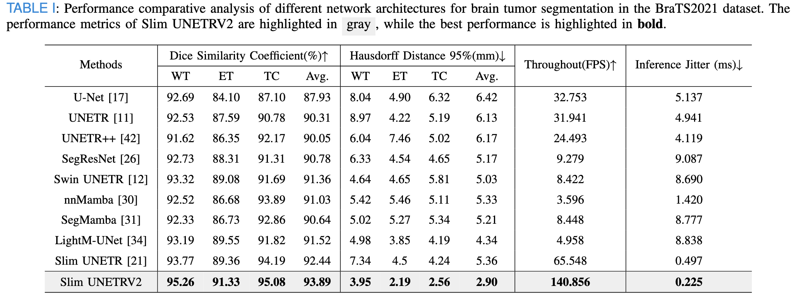
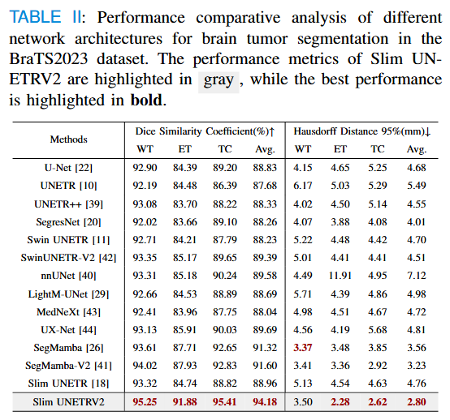
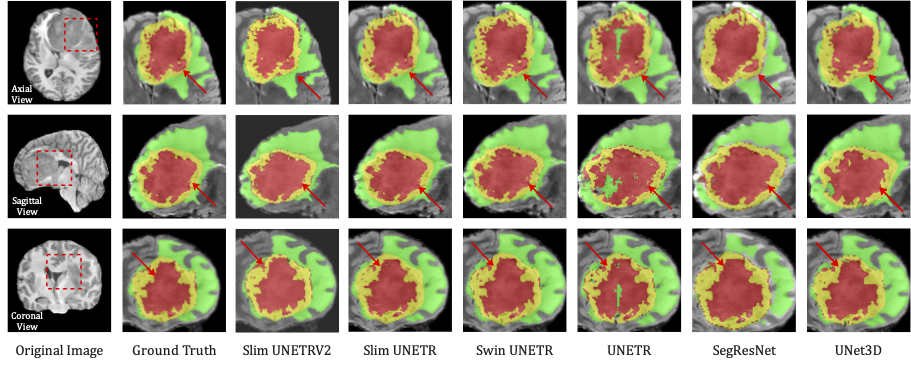
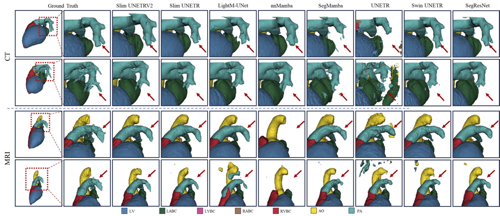

# Slim UNETRV2: 3D Image Segmentation for Resource-Limited Medical Portable Devices

> More details of this project will be released soon.

&nbsp;

# Network Architecture

# Data Description
## Dataset Name: BraTS2021

Modality: MRI

Size: 1251 3D volumes (876 Training + 375 Validation)

Challenge: RSNA-ASNR-MICCAI Brain Tumor Segmentation (BraTS) Challenge

- Register and download the official BraTS 21 dataset from the link below and place then into "TrainingData" in the dataset folder:

  https://www.synapse.org/#!Synapse:syn27046444/wiki/616992

  For example, the address of a single file is as follows:

  "TrainingData/BraTS2021_01146/BraTS2021_01146_flair.nii.gz"

- Download the json file from this [link](https://drive.google.com/file/d/1i-BXYe-wZ8R9Vp3GXoajGyqaJ65Jybg1/view?usp=sharing) and placed in the same folder as the dataset.

## Dataset Name: BraTS2023

Modality: MRI

Size: 1251 3D volumes (876 Training + 375 Validation)

Challenge: RSNA-ASNR-MICCAI Brain Tumor Segmentation (BraTS) Challenge

- Register and download the official BraTS 23 dataset from the link below and place then into "TrainingData" in the dataset folder:

  https://www.synapse.org/#!Synapse:syn27046444/wiki/616992

  For example, the address of a single file is as follows:

  "TrainingData/BraTS2023_01146/BraTS2023_01146_flair.nii.gz"

- Download the json file from this [link](https://www.med.upenn.edu/cbica/brats/) and placed in the same folder as the dataset.

## Dataset Name: MM-WHS

Modality: MRI / CT 

Size: 120 3D volumes (Both MRI / CT have 84 Training + 36 Validation)

Challenge: Multi-Modality Whole Heart Segmentation Challenge

- Register and download the official MM-WHS dataset from the link below and place then into "TrainingData" in the dataset folder:

  https://www.synapse.org/Synapse:syn51514105

  For example, the address of a single file is as follows:

  "TrainingData/MM_WHS/MRI/11238.nii.gz"

- Download the json file from this [link](https://mega.nz/folder/UNMF2YYI#1cqJVzo4p_wESv9P_pc8uA) and placed in the same folder as the dataset.

# Benchmark
## BraTS2021 dataset
Performance comparative analysis of different network architectures for brain tumor segmentation in the BraTS2021 dataset.

## BraTS2023 dataset
Performance comparative analysis of different network architectures for brain tumor segmentation in the BraTS2023 dataset.

## MM-WHS dataset
Performance comparison for heart segmentation using the MM-WHS dataset.

# Visualization

## BraTS2021 dataset
Qualitative visualizations of the Slim UNETRV2 and baseline approaches under BraTS2021 segmentation task.

## MM-WHS dataset
Qualitative visualizations of the Slim UNETRV2 and baseline approaches under MMWHS heart segmentation task.

