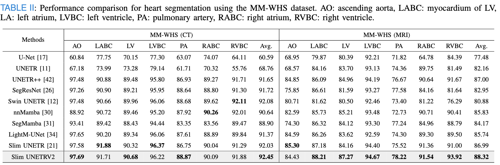

# Slim UNETRV2: 3D Image Segmentation for Resource-Limited Medical Portable Devices

🎉 This work is published in [IEEE Transactions on Medical Imaging](https://ieeexplore.ieee.org/document/11138028)

[](https://huggingface.co/deepang/slimunetrv2) 

BraTS 2023 weights and logs: [](https://huggingface.co/deepang/slimunetrv2/tree/main/brats23) MMWHS-CT weights and logs: [](https://huggingface.co/deepang/slimunetrv2/tree/main/mmwhs-ct) MMWHS-MRI weights and logs: [](https://huggingface.co/deepang/slimunetrv2/tree/main/mmwhs-mri) 


# Network Architecture


**Figure 1.** An overview of the Slim UNETRV2 network architecture.


## Training

To reproduce results or train Slim UNETRV2 on your data, follow the standard nnU-Net v2 training pipeline and use the provided trainers under the 3d_fullres configuration.

1) Environment configuration

- Install PyTorch first, then run the project setup script:
  ```bash
  pip install torch
  sh setup-env.sh
  ```

2) Dataset preparation (nnU-Net v2 format)

- Prepare datasets strictly following the nnU-Net v2 documentation (dataset structure, JSON metadata, and case naming conventions). Refer to the dataset specification here: [nnU-Net v2 Dataset Format](nnUNet/documentation/dataset_format.md). Set the nnU-Net paths before preprocessing:
  ```bash
  export nnUNet_raw=/path/to/nnUNet_raw
  export nnUNet_preprocessed=/path/to/nnUNet_preprocessed
  export nnUNet_results=/path/to/nnUNet_results
  ```
  For details on setting these paths, see: [setting_up_paths.md](nnUNet/documentation/setting_up_paths.md).
- Create the dataset folder `nnUNet_raw/DatasetXXX_MyDataset` with imagesTr, labelsTr (and imagesTs if applicable) as required by nnU-Net v2. Then run fingerprinting and planning for 3d_fullres:
  ```bash
  nnUNetv2_extract_fingerprints -d XXX
  nnUNetv2_plan_and_preprocess -d XXX -c 3d_fullres
  ```
  Replace `XXX` with your numeric dataset ID (e.g., 005 for BraTS).

3) Training with SlimUNETRV2 trainers (3d_fullres)

- For a 128×128×128 patch size use `SlimUNETRV2_128Trainer`:
  ```bash
  nnUNetv2_train XXX 3d_fullres 0 -tr SlimUNETRV2_128Trainer
  ```
- For a 96×96×96 patch size use `SlimUNETRV2_96Trainer`:
  ```bash
  nnUNetv2_train XXX 3d_fullres 0 -tr SlimUNETRV2_96Trainer
  ```
- Use folds `0–4` for cross-validation or `all` to aggregate across folds:
  ```bash
  nnUNetv2_train XXX 3d_fullres all -tr SlimUNETRV2_128Trainer
  ```

Notes

- The trainers are defined in [nnUNet/nnunetv2/training/nnUNetTrainer/variants/slim/slimUNETRV2Trainer.py](nnUNet/nnunetv2/training/nnUNetTrainer/variants/slim/slimUNETRV2Trainer.py) and internally set the patch size and architecture hyperparameters consistent with the Model Hyperparameters section.
- The SlimUNETRV2 model architecture is defined in [nnUNet/nnunetv2/nets/SlimUNETRV2.py](nnUNet/nnunetv2/nets/SlimUNETRV2.py).
- Always use the `3d_fullres` configuration for training Slim UNETRV2 to match the intended design and reported results.

## Model Hyperparameters

The following hyperparameters were utilized for different input image dimensions:

*   **For input images of size 128x128x128:**
    ```python
    SlimUNETRV2(in_chans=1, out_chans=3, kernel_sizes=[4, 2, 2, 2], num_slices_list=[64, 32, 16, 8])
    ```
*   **For input images of size 96x96x96:**
    ```python
    SlimUNETRV2(in_chans=1, out_chans=3, kernel_sizes=[2, 2, 2, 2], num_slices_list=[16, 8, 4, 2])
    ```

# Performance


**Figure 2.** Comparative performance analysis of various frameworks on the BraTS 2023 dataset. (A) Evaluation of Dice Similarity Coefficient (DSC) and Throughput, where higher values signify superior performance. (B) Assessment of 95% Hausdorff Distance (HD95%) and Inference Jitter, where lower values indicate better performance.


# Data Description
## Dataset Name: BraTS 2021

Modality: MRI

Size: 1251 3D volumes (876 Training + 375 Validation)

Challenge: RSNA-ASNR-MICCAI Brain Tumor Segmentation (BraTS) Challenge

- Register and download the official BraTS 2021 dataset from the link below and place them into "TrainingData" in the dataset folder:

  https://www.synapse.org/#!Synapse:syn27046444/wiki/616992

  Example path:

  "TrainingData/BraTS2021_01146/BraTS2021_01146_flair.nii.gz"

- Download the JSON file from this [link](https://drive.google.com/file/d/1i-BXYe-wZ8R9Vp3GXoajGyqaJ65Jybg1/view?usp=sharing) and place it in the same folder as the dataset.

## Dataset Name: BraTS 2023

Modality: MRI

Size: 1251 3D volumes (876 Training + 375 Validation)

Challenge: RSNA-ASNR-MICCAI Brain Tumor Segmentation (BraTS) Challenge

- Register and download the official BraTS 2023 dataset from the link below and place them into "TrainingData" in the dataset folder:

  https://www.synapse.org/#!Synapse:syn27046444/wiki/616992

  Example path:

  "TrainingData/BraTS2023_01146/BraTS2023_01146_flair.nii.gz"

- Download the JSON file from this [link](https://www.med.upenn.edu/cbica/brats/) and place it in the same folder as the dataset.

## Dataset Name: MM-WHS

Modality: MRI / CT 

Size: 120 3D volumes (Both MRI / CT have 84 Training + 36 Validation)

Challenge: Multi-Modality Whole Heart Segmentation Challenge

- Register and download the official MM-WHS dataset from the link below and place them into "TrainingData" in the dataset folder:

  https://www.synapse.org/Synapse:syn51514105

  Example path:

  "TrainingData/MM_WHS/MRI/11238.nii.gz"

- Download the JSON file from this [link](https://mega.nz/folder/UNMF2YYI#1cqJVzo4p_wESv9P_pc8uA) and place it in the same folder as the dataset.

# Benchmark
## BraTS 2021 dataset
Performance comparative analysis of different network architectures for brain tumor segmentation in the BraTS 2021 dataset.


## BraTS 2023 dataset
Performance comparative analysis of different network architectures for brain tumor segmentation in the BraTS 2023 dataset.


## MM-WHS dataset
Performance comparison for heart segmentation using the MM-WHS dataset.



# Visualization

## BraTS 2021 dataset
Qualitative visualizations of Slim UNETRV2 and baseline approaches for the BraTS 2021 segmentation task.


## MM-WHS dataset
Qualitative visualizations of Slim UNETRV2 and baseline approaches for the MM-WHS heart segmentation task.


# Citation

If you find this repository useful, please cite:

```bibtex
@ARTICLE{11138028,
  author={Pang, Yan and Liang, Jiaming and Yan, Junming and Hu, Ying and Chen, Hao and Wang, Qiong},
  journal={IEEE Transactions on Medical Imaging}, 
  title={Slim UNETRV2: 3D Image Segmentation for Resource-Limited Medical Portable Devices}, 
  year={2025},
  volume={},
  number={},
  pages={1-1},
  keywords={Image segmentation;Accuracy;Jitter;Decoding;Medical diagnostic imaging;Three-dimensional displays;Feature extraction;Computational modeling;Solid modeling;Image analysis;3D medical segmentation;lightweight;on-device model;resource-limited application},
  doi={10.1109/TMI.2025.3602145}}
```

# License

This project is licensed under the MIT License. See [LICENSE](LICENSE) for details.
